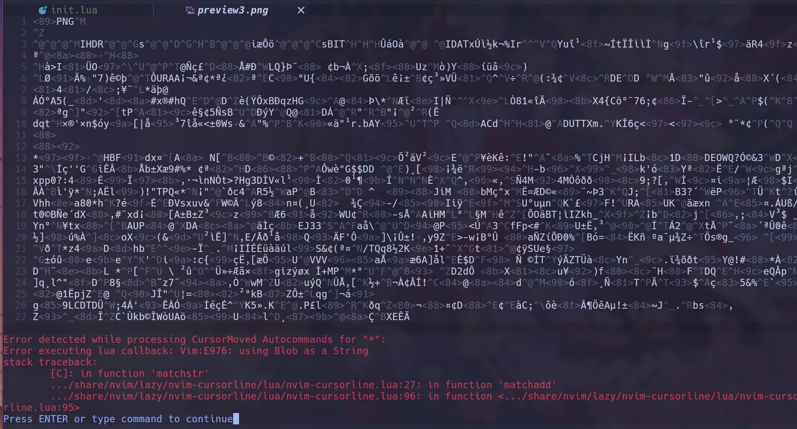

## STCursorword

A concise, precise, and high-performance cursor word highlighting plugin for Neovim, implemented in Lua.

- ❓ [Reasons for creating](#reason)
- 👀 [Installation](#installation)
- 💻 [Configuration](#configuration)
- 😆 [Usage](#usage)
- 😁 [Contributing](#contributing)
- ✌️ [License](#license)

## Reasons <a name = "reason"></a> for creating this plugin

🎉 There are many plugins that do this, but none of them support disabling for certain filetypes. So, If I accidentally open a binary file such as .png file it gives me an error

🛠️ Other plugins always reset highlighting when the cursor moves, whereas this plugin does not. It only resets the highlighting when the cursor moves to a new word.

For example, if the cursor is on the character `h` in the word `hello`, and you move the cursor to `e`, other plugins will remove the highlighting from the word `hello` and then highlight it again, even though the cursor is still on that word. Consequently, when you move to the `o`, it will undergo highlighting five times.

🍕 Easily to disable and enable when needed.

🚀 And a subjective reason is that I used to use the [nvim-cursorline](https://github.com/yamatsum/nvim-cursorline) plugin before, but I don't use the cursorline feature. Another plugins i found that [nvim-cursorword](https://github.com/xiyaowong/nvim-cursorword), it works quite similar to this plugin, but its setup method is not like the plugins I usually use. So this is the reason for this plugin.

## Preview

https://github.com/sontungexpt/stcursorword/assets/92097639/2beb58cf-d6f9-44f9-979d-dea280a52b4d

Compare with nvim cursorline

Nvim cursorline error when accidentally open a binary file



This plugin fixed this error.

https://github.com/sontungexpt/stcursorword/assets/92097639/d00be822-dfcf-47e8-8e97-a2a6ae0b6abf

## Installation

```lua
    -- lazy
    {
        "sontungexpt/stcursorword",
        event = "VeryLazy",
        config = true,
    },
```

## Configuration

```lua
    -- default configuration
    require("stcursorword").setup({
        max_word_length = 100, -- if cursorword length > max_word_length then not highlight
        min_word_length = 2, -- if cursorword length < min_word_length then not highlight
        excluded = {
            filetypes = {
                "TelescopePrompt",
            },
            buftypes = {
                -- "nofile",
                -- "terminal",
            },
            patterns = { -- the pattern to match with the file path
                -- "%.png$",
                -- "%.jpg$",
                -- "%.jpeg$",
                -- "%.pdf$",
                -- "%.zip$",
                -- "%.tar$",
                -- "%.tar%.gz$",
                -- "%.tar%.xz$",
                -- "%.tar%.bz2$",
                -- "%.rar$",
                -- "%.7z$",
                -- "%.mp3$",
                -- "%.mp4$",
            },
        },
        highlight = {
            underline = true,
            fg = nil,
            bg = nil,
        },
    })
```

## Usage

| **Command**          | **Description**                             |
| -------------------- | ------------------------------------------- |
| `:CursorwordEnable`  | Toggle highlight the word under the cursor  |
| `:CursorwordEnable`  | Enable highlight the word under the cursor  |
| `:CursorwordDisable` | Disable highlight the word under the cursor |

## Contributing

Pull requests are welcome. For major changes, please open an issue first to discuss what you would like to change.

## License

This project is licensed under the MIT License - see the [LICENSE](LICENSE) file for details
